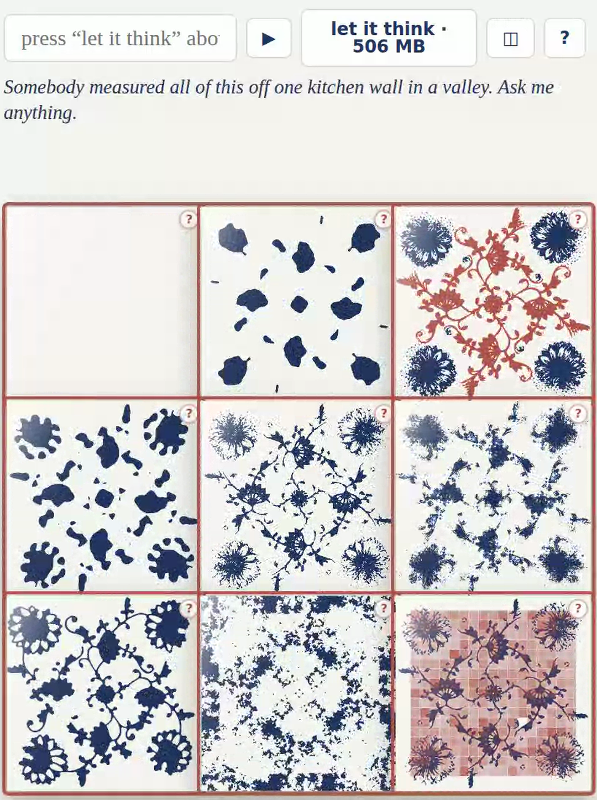
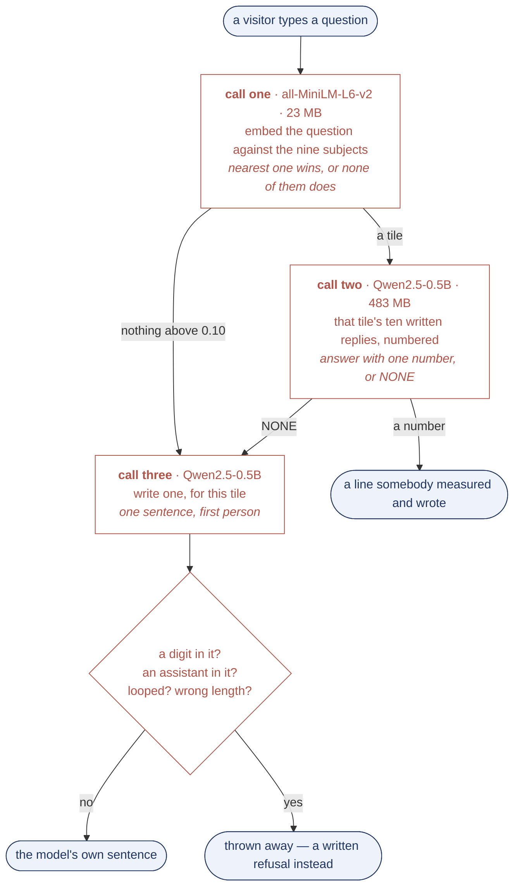

# underglaze

**[Talk to a brick wall →](https://unt1l1f1nd-talk-to-a-brick-wall.static.hf.space)**



One kitchen wall in a valley under the Krkonoše, photographed once. Nine tiles, each put a
different question about itself, each answering with a number measured off that photograph.

**When you are lonely you talk to the kitchen tiles. This one talks back, and you learn
something.**

```
f(x,y) = Σ a_mn [ cos 2π(mx+ny)/L  +  cos 2π(−nx+my)/L ]     blue where f > ½
```

C4 plus reality force every coefficient real — there are no sine terms. Every `a_mn` is measured,
none chosen.

## How it answers you

Two models, both in the visitor's own browser, behind one button that says what it costs before
it spends it. No server, no key, nothing leaves the page.



`src/eval_flow.py` presses the real button in a real browser, so it cannot drift from what
ships. One run, 141 questions:

| | |
|---|---|
| **call one** · 23 MB · 13 ms | 99 of 123 land on the right tile |
| **call two** · 483 MB · 14 s | 13 distinct lines over 27 questions, takes the first 11 times |
| **call three** · 483 MB · 15 s | writes for 4 of the 18 that reach it, 2 thrown away |

A 23 MB model that produces no words beats a 483 MB one at deciding what a question is about,
and loses to it at deciding which sentence answers it.

**And call two cannot refuse.** Refusing here is a handover: when none of a tile's ten written
lines answers the question, call two is meant to come back empty so call three writes one. It
does that 6 times out of 18 — the other 12 get a measured sentence that does not answer them.
It never refuses wrongly either, 0 of 27. Its whole bias is to answer. Three prompt shapes were
measured and none worked; `src/eval_gate.py` puts five of them to the model on their own, and
what comes back does not depend on the question. All of it is in `evals/flow.md`.

Press **▶** instead and the wall runs on its own — every tile at once, no model, no download.

## What did not work

- The chirality knob could not be shown to look more twisted: no skeleton segment over 27 px.
- `Ea` for Co²⁺ in a glaze melt moves the predicted bleed width by 40×, so no length is quoted.
- The Porod slope could not tell a fractal from a smooth boundary.
- A copyist who only remembers, with no original on the desk, does worse than no copyist at all.
- Call two cannot be made to hand over. Every shape tried is in the comment above it.
- Whether the nine tiles are one print or nine is undecided: +0.006 against +0.132 for a
  meaningless shift, which measures a failed registration and nothing else.

## Files

`src/` is one module per tile, each generating the table in `theory/` named at the top of it —
regenerate, do not hand-edit. `src/build_wall.py` writes the page; `src/eval_flow.py` scores the
three calls inside it; `src/film_wall.py` films it.
