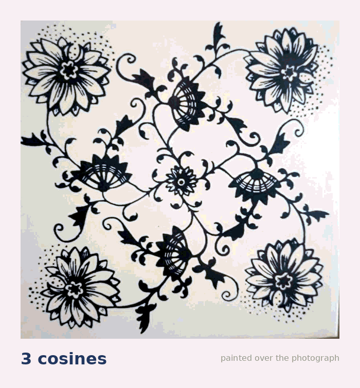

# underglaze



A kitchen tile in a deep valley under the Krkonoše, written as a sum of cosines.

```
f(x,y) = Σ a_mn [ cos 2π(mx+ny)/L  +  cos 2π(−nx+my)/L ]     blue where f > ½
```

**62 815 cosines for 99 % of it.** Every `a_mn` measured off the photograph, none chosen.

**[Drag the three knobs →](https://unt1l1f1nd-underglaze.static.hf.space)**

### Two things that fell out

Put the origin on the tile's four-fold centre and C4 plus reality force every coefficient
**real** — there are no sine terms at all. The group is **p4**: rotations +0.52, mirrors
+0.18, against a +0.12 meaningless-shift control. So `a_mn` and `a_nm` are free to differ,
and making them equal turns the plant into a snowflake.

And it is **not** cibulák. Zwiebelmuster has five motifs; audited against a marked Meissen
plate this tile has the aster and none of the fruit. *An onion pattern with no onion in it.*

### Files

```
src/fourier.py    the series — the written cos form matches the FFT to 5e-15
src/symmetry.py   which wallpaper group, measured before anything was drawn
src/chirality.py  one knob: a_mn(t) = (1+t)/2 a_mn + (1−t)/2 a_nm
src/kiln.py       blur + re-threshold = Merriman–Bence–Osher = curvature flow
src/scales.py     how far cobalt diffuses in a firing, and whether it is measurable
src/curl.py       a failed measurement, kept — see below
```

`Ea` for Co²⁺ in a glaze melt is unpinned and moves the predicted edge width by 40×, so no
bleed length is quoted. `curl.py` tried to show that a larger chirality looks *more twisted*
and could not: the skeleton of this pattern has no segment longer than 27 px.
