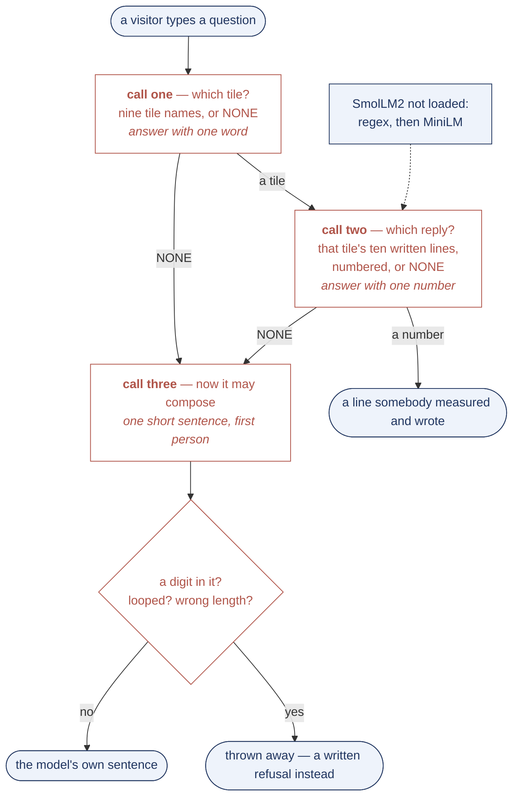

# underglaze

**[Talk to a brick wall →](https://unt1l1f1nd-talk-to-a-brick-wall.static.hf.space)**

One kitchen wall in a valley under the Krkonoše, photographed once. Nine tiles, each put a
different question about itself, each answering with a measured number. Ask it in plain words,
or let a browser agent drive it.

| the tile asks | it answers |
|---|---|
| how many cosines I take | 62 815 for 99 %; strokes are worse at every budget |
| what the fire does to me | perimeter 40 744 → 6 210; curvature flow has no fixed point |
| when my blue joins up | largest piece 10.7 % → 46.3 % between θ = 0.55 and 0.53 |
| what you actually see of me | 26 129 cosines reach an eye at 2 m, 6 427 at 4 m |
| which way I curl | p4, not p4m — mirrors score at the level of a meaningless shift |
| the fractal I am not | box dimension climbs 0.90 → 1.95; a fractal holds one value |
| three centuries of being copied | with a copyist 0.795 after 25 firings; without, the fine work goes |
| how much of me can be replaced | 5 % of the largest coefficients, and it is a different tile |
| what attention finds in me | repetition, never symmetry — lift 0.2–0.9 against chance |

## The equation

```
f(x,y) = Σ a_mn [ cos 2π(mx+ny)/L  +  cos 2π(−nx+my)/L ]     blue where f > ½
```

Put the origin on the tile's four-fold centre and C4 plus reality force every coefficient
**real** — there are no sine terms. Every `a_mn` is measured off the photograph, none chosen.

## Three results worth the trip

**It is not cibulák.** Zwiebelmuster has five motifs; audited against a marked Meissen plate this
tile has the aster and none of the fruit. *An onion pattern with no onion in it.*

**Identity is a few dozen numbers.** Keep every magnitude and give 5 % of the signs fresh random
values, largest first, and the tile scores 0.149 against itself — below the 0.186 that two
unrelated rebuilds reach by chance. Replace 95 % of the smallest and it still scores 0.618.

**Attention cannot see symmetry.** Patches as their own queries and keys land on their p4
partners *less* than chance. Cosine similarity is not rotation-invariant and p4 acts by rotation,
so a mechanism blind to geometry finds repetition and never symmetry.

## What is not settled

`curl.py` tried to show that a larger chirality looks *more twisted* and could not: the skeleton
has no segment longer than 27 px. `Ea` for Co²⁺ in a glaze melt is unpinned and moves the
predicted edge width by 40×, so no bleed length is quoted. The Porod slope could not separate a
fractal from a smooth boundary. The copyist who only remembers a vocabulary does **worse** than
no copyist at all, which may be a fact or may be an artefact of the measure. Whether the nine
tiles are one print or nine is undecided: tile-to-tile correlation came out at +0.006 against
+0.132 for a meaningless shift, which measures a failed registration and nothing else.

## Which model drives it?

Nothing is downloaded when the page opens. That was not true until today: a 23 MB
embedding model, **all-MiniLM-L6-v2**, fetched itself the moment anybody arrived, to route
questions to tiles. It was a good router and nobody agreed to it, so it is gone.

What routes the question now is a table of phrase rules, and what answers is the tile's own
headline sentence. No model, no download, no waiting. There is a button — **let it think ·
117 MB** — that fetches **SmolLM2-135M-Instruct** and runs it in the browser, no server and
no key, and once it is here the button and the notice remove themselves.

## What SmolLM2-135M can actually do here, measured

The design was three calls in a row: *which tile*, then *which of that tile's ten written
replies*, then — only if the second came back empty — *one sentence of its own for that tile*.
It never writes a number: a digit in call three and the sentence is thrown away, because every
number on this page was measured off one photograph.

`src/eval_flow.py` presses the real button in a real browser and scores the real calls, so it
cannot drift from what ships. Twenty-seven questions: nine tiles asked plainly twice over, and
nine that are not about this wall at all.

| | |
|---|---|
| call one, the nine asked plainly | **0 / 18** |
| call one, not about the wall, should be NONE | **9 / 9** |
| call two, distinct lines reached across nine tiles | **9** |
| call two, took the first option | **18 / 18** |

It picks a tile zero times out of eighteen, and it answers "1" to every list of ten. The 9/9 is
not judgement, it is a model that refuses everything. Five prompt shapes were tried — bare
names, names with glosses, an options list, a labels list, the nine headline sentences numbered
— and the best of them reached 5/12 on a smaller set, almost all of it refusals. Asked whether
it was a fractal it still says *"I'm a fractal"*, which is the one thing this page spends a page
disproving.

So the button is honest about what it fetches and the eval is honest about what arrives. The
phrase rules route the question; the model is loaded, measured, and not yet load-bearing.
`evals/flow.md` has every answer it gave.

**The rules, for comparison.** Four question sets, in `src/eval_wall.py`. The first 51 were
written next to the patterns; the next 30 blind; the next 30 after both routers existed and
shown to neither while being written; the last 30 are what people actually type — one word,
typos, Czech, emoji, boredom, prompt injection, nothing at all.

| | 30 fresh questions | 30 weird inputs | total |
|---|---|---|---|
| regular expression alone | 14 | **25** | 39 |
| all-MiniLM-L6-v2 alone | **21** | 19 | 40 |
| words first, model for the rest | 20 | 25 | **45** |

The regex scores 81/81 on the sets it was tuned on and 47 % on fresh ones, which is what
overfitting looks like from the inside. That 45 is the number the page used to run at, with
MiniLM arriving uninvited to earn it. It runs on the 39 now, and asks first.

## The wall opens as a wall

Nine sliders, and every one of them is a way of breaking the pattern. So each has a position
where the frame is closest to the tile that was photographed, and it is downhill from there in
both directions. That position is where the page opens, and it is measured rather than chosen:
`src/likeness.py` scores all 235 frames in RGB against the ink taken off the photograph and
takes the argmax per tile. Six of the nine land on an end of their slider; percolation lands on
step 8 of 26, two clicks before its own transition; attention on 25 of 26.

RGB and not overlap-of-ink, because overlap cannot see colour — on shape alone the wall opened
on an attention frame that was entirely orange and scored 0.95 for it.

Click a tile's **?** and the tile comes off the wall: it hinges on its bottom edge, tips out,
and what is behind it is the mortar bed it was set into, with the writing on a patch of
limewash. The mortar is generated (`src/plaster.py`) rather than drawn in CSS, because CSS
gradients cannot do relief, and its colour is the lit face of the real grout in `web/wall.jpg`
divided by the white of the tile beside it.

## Three prompts, and not one of them writes the answer

This is the shape, and the measurement above is what happens when a 135M model is asked to walk
it. The point of the shape is that no call is ever asked to compose a claim: two of the three
are a choice out of a short list, and the third may not contain a digit.



I tried it the other way first and let the model write the answers. Asked whether it was a
fractal it said *"I'm a fractal"* — the one thing the page had just spent a page disproving.
**Classify, do not compose.** Which is the right lesson, and the eval above is the bill for
finding out that this model cannot do the classifying either.

## Files

```
src/fourier.py      the series — the written cos form matches the FFT to 5e-15
src/symmetry.py     which wallpaper group, measured before anything was drawn
src/chirality.py    one knob: a_mn(t) = (1+t)/2 a_mn + (1−t)/2 a_nm
src/kiln.py         blur + re-threshold = Merriman–Bence–Osher = curvature flow
src/scales.py       how far cobalt diffuses in a firing, and whether it is measurable
src/strokes.py      cosines priced against a stroke basis at equal fidelity
src/fractal.py      three tests for a fractal, one of which decides nothing
src/fractalise.py   building one anyway, to check the ruler
src/percolation.py  where the threshold stops being a choice
src/acuity.py       what an eye receives from across the room
src/theseus.py      how much can be replaced before it is a different tile
src/attention.py    repetition yes, symmetry no
src/memory.py       the kiln with a copyist who has the original on her desk
src/hopfield.py     the honest version, where she only remembers — it fails
src/wall.py         the wall's lattice, and the comparison that is not settled
src/eval_wall.py    81 questions put to the router
src/curl.py         a failed measurement, kept
src/likeness.py     where each slider stands when the tile most looks like the tile
src/plaster.py      what is behind a tile, once the tile is off
src/film_wall.py    films the page answering three questions, 1 tile then 3 then 9
src/eval_flow.py    presses the button and scores the three calls, in the page
```

Every table in `theory/` is generated by the module named at the top of it. Regenerate, do not
hand-edit.
